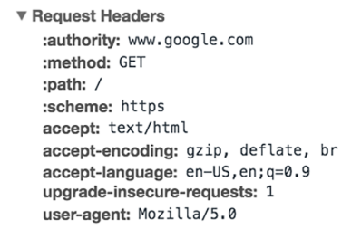
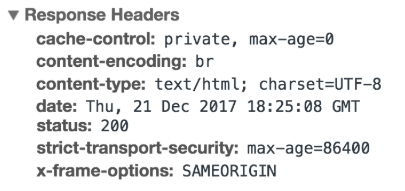

# 概要

## 📌 要点まとめ

| 項目      | 内容                                |
| ------- | --------------------------------- |
| プロトコル名  | HTTP（HyperText Transfer Protocol） |
| 役割      | ブラウザとサーバー間のデータ通信                  |
| 通信形式    | **リクエスト → レスポンス** のやり取り           |
| 主な構成要素  | メソッド／ヘッダー／ボディ（任意）                 |
| 応答の仕組み  | ステータスコード／ヘッダー／コンテンツ               |
| 特徴      | ステートレス／TCP接続／セッションは別管理            |
| セキュリティ面 | HTTP Flood のような DDoS への耐性が課題      |

# 詳細

## 🔍 HTTP（ハイパーテキスト転送プロトコル）とは？

* HTTP は **Web（World Wide Web）上のデータ転送を支える基盤的なプロトコル**で、主にウェブブラウザとウェブサーバ間で情報をやり取りするために使われます。
* OSIモデルでいうと **アプリケーション層**に位置し、下位層（TCP/IPなど）の上で動作します。

## 🌐 HTTP の基本的な流れ

1. クライアント（たとえばブラウザ）がサーバに **HTTPリクエスト**を送信
2. サーバがその要求に応じて **HTTPレスポンス**を返送

この仕組みによって、ウェブページのテキスト、画像、動画などが表示されます。

## 🧩 HTTPリクエストの構成要素

* **HTTPメソッド（動詞）**
  例：`GET`（情報取得）、`POST`（データ送信）など

* **リクエストヘッダー**
  ブラウザの種類、受け取るデータの形式などを指定する、キーと値の組（例：`Host: example.com`）

* **リクエストボディ**（任意）
  フォーム送信時などに含まれる本文部分。  
  ユーザー名・パスワードなどのデータが入ります。

さらに、HTTP バージョンや URL もリクエストの一部として含まれます。

## 📤 HTTPレスポンスの構造

* **ステータスコード**
  3桁の番号で結果を示します。

  * `2xx`：成功例（例：200 OK）
  * `4xx`：クライアント側エラー（例：404 NOT FOUND）
  * `5xx`：サーバー側エラー

* **レスポンスヘッダー**
  コンテンツタイプや長さ、キャッシュ情報など、レスポンスに関するメタデータを含みます

* **レスポンスボディ**（任意）
  実際にクライアントに返されるHTML文書や画像などの内容。  
  GETリクエスト成功時には通常こちらにデータが含まれます。

---

## ⚙️ その他特徴・補足

* **ステートレスな設計**
  HTTPは各リクエストを個別に扱うため、前後の通信内容を記憶しません。  
  このため、セッション管理にはクッキーなど別の仕組みが必要です。  

* **TCPを利用した接続**
  HTTP/1.x では、リクエストごとに TCP 接続を行い、終了するのが基本でした。  
  HTTP/1.1では `Keep‑alive` による接続の再利用が導入され、パフォーマンスが向上しました。  

* **DDoS攻撃との関連**
  HTTPは第7層（アプリケーション層）のプロトコルであり、**大量の GET や POST リクエストを送りつける「HTTP Flood」攻撃**が発生する可能性があります。  
  そのため、Webサイトのセキュリティ設計で対応が重要です。  
  
# 参考資料

- [What is HTTP?](https://www.cloudflare.com/en-gb/learning/ddos/glossary/hypertext-transfer-protocol-http/)
