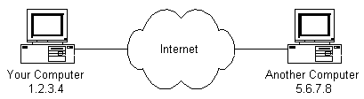
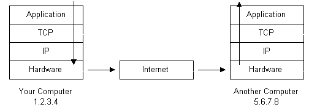

# 概要

## 🔍 要点まとめ

| 項目         | 内容                                 |
| ---------- | ---------------------------------- |
| インターネット    | 世界中のネットワークをつなぐ基盤、IP/TCP により耐障害性を確保 |
| クライアント・サーバ | ブラウザとサーバーが HTTP（など）で通信             |
| プロトコル階層    | IP／TCP／HTTP などが階層的に構成              |
| DNS        | ドメイン名を IP に変換し、URL を人間向けに扱いやすくする   |
| Web（WWW）   | HTML 文書とリンク構造に基づく分散型のハイパーテキストシステム  |
| 商業化の進展     | 1990年代以降、インターネットが広く社会・経済に浸透        |

# 詳細

## 1. はじめに

インターネットを支えるインフラや技術の概要を分かりやすく解説しますが、専門的な深掘りまではしておらず基本的な理解を目的としています。  

## 2. インターネットとは何か？

* インターネットは、世界中のネットワークを接続する「ネットワークのネットワーク」です。
* 主要な通信プロトコルとしては、IP（アドレス指定）とTCP（データをパケットに分割して送信）があります。
* これらは冷戦期に耐障害性を重視して設計され、どこか一部が故障しても通信が維持できるようになっています。

## 3. クライアント・サーバ型の仕組み

* ユーザーは「クライアント（例：ウェブブラウザ）」を使い、サーバーに情報を要求します。
* ウェブでは HTTP（Hypertext Transfer Protocol）が使用され、TCP/IP の上に乗っています。
* ファイル転送（FTP）や電子メール（SMTP）など、それぞれ専用のプロトコルがあります。

## 4. IPアドレスとDNS

* インターネット上の各デバイスには一意の IPアドレス（例：192.168.0.1）が割り当てられます。
* DNS（Domain Name System）は、人間が覚えやすいドメイン名（例：example.com）を IPアドレスに変換する仕組みです。
* これにより URL が簡単に使えるようになります。

## 5. プロトコル階層とパケット伝送

* データ通信は「プロトコルスタック」として階層化されています。
  * 下層：IPでパケットをルーティング
  * 中層：TCPで信頼性ある伝送を確保
  * 上層：HTTP、SMTP などアプリケーションプロトコルで具体的な通信内容を扱う

* 例えば、電子メールなら SMTP、ウェブ通信なら HTTP を使ってサーバーとやり取りします。

## 6. インターネットのインフラとルーティング階層

* 世界中に分散された ISP（Internet Service Provider）やルーター、バックボーン回線などが、通信を支えています。
* インターネット全体は階層構造を持ち、パケットが最適な経路を自動的に選んで送られるよう設計されています。

## 7. World Wide Web の仕組み

* WWW（ワールド・ワイド・ウェブ）は、Webページを HTML 形式で配信する分散型ハイパーテキストシステムです。
* HTML 文書はリンクや画像、動画などを含み、他の文書と自由に結びつけられます。
* Webのアイデアは、CERNのティム・バーナーズ＝リーによって発案され、Mosaic や Netscape の登場で急速に普及しました。

## 8. 経済的・商業的な展開

* 当初は大学や政府機関中心だったインターネットですが、1990年代中頃から商業化が加速しました。
* "​.com​" ドメインの急増や、金融機関などによるインターネット利用の拡大がその証拠です。

# 参考資料

- [How Does the Internet Work?](https://web.stanford.edu/class/msande91si/www-spr04/readings/week1/InternetWhitepaper.htm)
