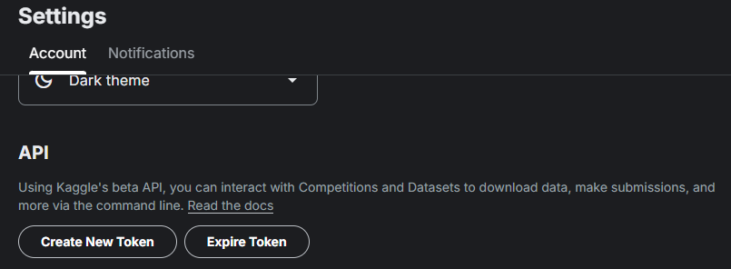
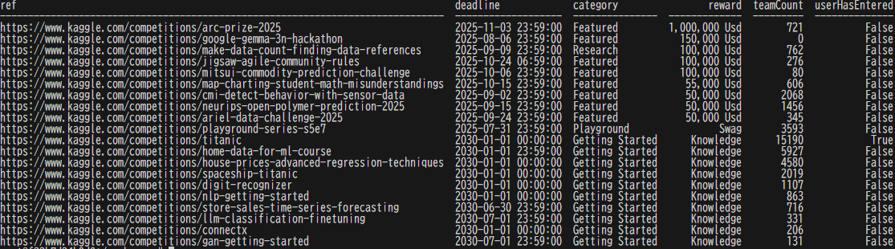

# 概要

Windows11 + WSL2 + DockerでのKaggle環境構築。  

# 詳細
## 前提
WSL2上のDocker環境は手元で構築済み。  

## 手順
### 1. Kaggle API トークンの準備
1. Kaggle にログインし、右上のアカウントアイコン > setteings をクリック  
    
2. Create New Token をクリック  
      
3. `kaggle.json` がダウンロードされるので、WSL のホームディレクトリに配置
    ```bash
    $ mkdir -p ~/.kaggle
    $ mv /mnt/c/Users/＜ユーザ名＞/Downloads/kaggle.json ~/.kaggle/
    $ chmod 600 ~/.kaggle/kaggle.json
    ```

### 2. Docker イメージの作成
作業用ディレクトリを作り、以下のファイルを用意。  
1. ディレクトリを作成
    ```bash
    $ mkdir -p ~/workspace/kaggle/.devcontainer
    ```

2. `.devcontainer/Dockerfile`
    ```dockerfile
    FROM python:3.12.8

    # 必要なパッケージ
    RUN apt-get update \
        && DEBIAN_FRONTEND=noninteractive apt-get install -y \
            tzdata \
            git \
            locales \
        && ln -snf /usr/share/zoneinfo/Asia/Tokyo /etc/localtime \
        && echo "Asia/Tokyo" > /etc/timezone \
        \
        # ロケール設定
        && echo "ja_JP.UTF-8 UTF-8" > /etc/locale.gen \
        && locale-gen \
        && update-locale LANG=ja_JP.UTF-8 \
        \
        && apt-get clean \
        && rm -rf /var/lib/apt/lists/*

    # 環境変数でデフォルトロケールを指定
    ENV LANG=ja_JP.UTF-8 \
        LC_ALL=ja_JP.UTF-8

    # 仮想環境を /opt/venv に作成
    ENV VENV_PATH=/opt/venv
    RUN python -m venv $VENV_PATH

    # PATH を仮想環境へ
    ENV PATH="$VENV_PATH/bin:$PATH"

    # pipアップグレード
    RUN pip install --upgrade pip

    # 必要なパッケージを requirements.txt からインストール
    COPY requirements.txt /tmp/requirements.txt
    RUN pip install --no-cache-dir -r /tmp/requirements.txt

    # 作業ディレクトリ
    WORKDIR /workspace
    ```

3. `.devcontainer/devcontainer.json`
    ```json
    {
    "name": "Kaggle-WSL-Docker",
    "build": {
        "dockerfile": "Dockerfile",
        "context": ".."
    },
    // コンテナ起動後に自動で実行するコマンド
    "postCreateCommand": "pip install --upgrade pip",

    // VS Code 側設定
    "settings": {
        // ワークスペースルートを /workspace に合わせる
        "python.defaultInterpreterPath": "/usr/local/bin/python"
    },


    // ホスト側の ~/.kaggle を読み取り専用マウント
    "mounts": [
        "source=${localEnv:HOME}/.kaggle,target=/root/.kaggle,type=bind,consistency=cached,readonly"
    ],

    // 拡張機能の自動インストール
    "extensions": [
        "ms-python.python",
        "ms-toolsai.jupyter"
    ],

    // コンテナ内の作業ディレクトリ
    "workspaceFolder": "/workspace"
    }
    ```

### 3. 利用手順
1. プロジェクトルートで VS Code を開く
2. 左下の`><`アイコン → コンテナーで再度開く を選択
3. ビルドが走り、コンテナ内で VS Code が立ち上がる

### 4. Kaggle API 動作確認
開催中コンペの取得を実行してみる。  


# 参考資料

- [参考リンク1](…)
- 書籍：○○○○